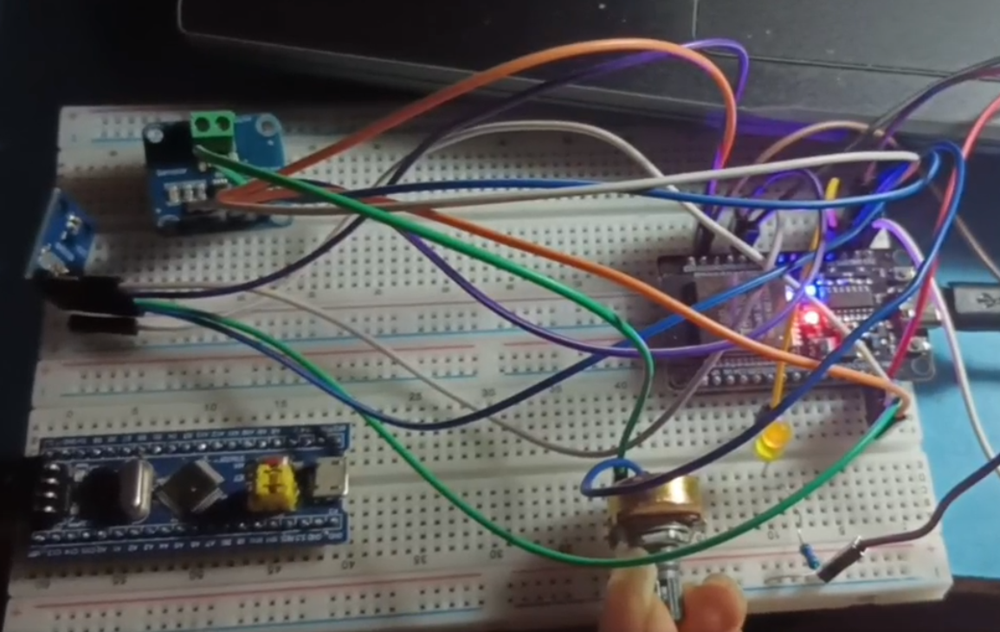
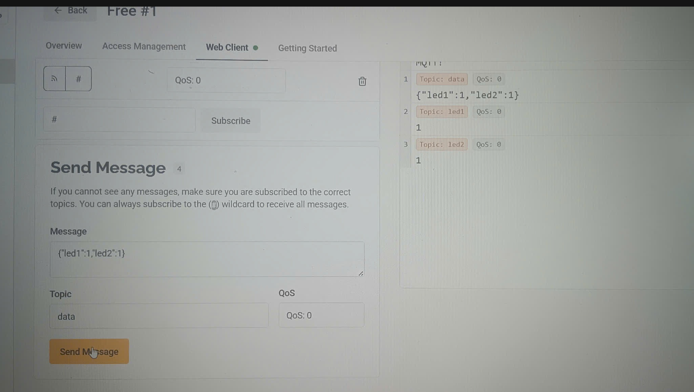
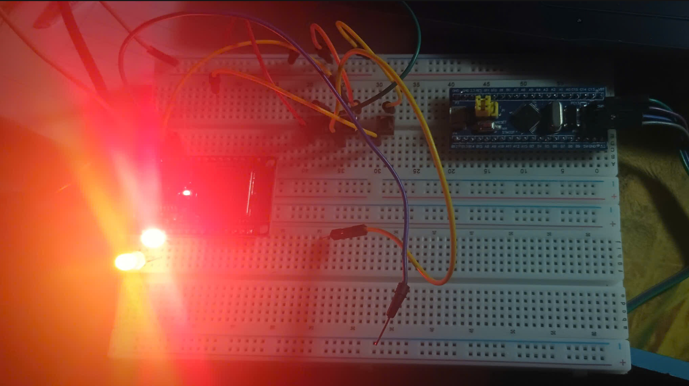

# D23_LÊ ĐÌNH HÒA
báo cáo công việc ngày 3/9/2026

# A. Công việc đã làm

## 1. Nghiên cứu và thực hành ADC 

Trong quá trình tìm hiểu về ngoại vi ADC trên vi điều khiển STM32, em đã thực hiện các nội dung sau

### 1.1 Đọc giá trị ADC từ biến trở và hiển thị qua UART
- Sử dụng **biến trở** làm tín hiệu analog đầu vào cho chân ADC.
- Giá trị ADC sau khi chuyển đổi được truyền qua **UART** và hiển thị trên phần mềm **Hercules** trên máy tính.
- Qua đó kiểm tra được sự thay đổi giá trị ADC khi xoay biến trở.

```

	#include "stm32f10x.h"                  // Device header
	#include "stm32f10x_gpio.h"             // Keil::Device:StdPeriph Drivers:GPIO
	#include "stm32f10x_rcc.h"              // Keil::Device:StdPeriph Drivers:RCC
	#include "UART.h"

	void delay_ms(int time){
		while(time)
		{
			SysTick -> LOAD = 72000 - 1;
			SysTick -> VAL  = 0;
			SysTick -> CTRL = 5;
			while(!(SysTick -> CTRL & ( 1 << 16))){/*wwait for COUNTFLAG*/}
			--time;
		}
	}
	void delay_us(int time)
	{
		while(time)
		{
			SysTick -> LOAD = 72 - 1;
			SysTick -> VAL  = 0;
			SysTick -> CTRL = 5;
			while(!(SysTick -> CTRL & ( 1 << 16))){/*wwait for COUNTFLAG*/}
			--time;
		}
	}


	void ConfigADC(){

		RCC -> CFGR    |= 0x8000;  // ADC chi hoat dong vs TSO <14MHz nen 72MHZ/6
		/*cho ADC1, GPIOA, AFIO enable*/
		RCC -> APB2ENR |= 0x205; //bat ADC1 vaAF VA port A
    GPIOA->CRH &= ~(0xF << 4);
    GPIOA->CRH |=  (0xB << 4); // 1011 chan truyen
		GPIOA->CRH &= ~(0xF << 8); // chan 10 nhan
     GPIOA->CRH |=  (0x4 << 8);
		/*Cau hinh chan PA5 la channel5 : Pin in put push pull*/
		GPIOA->CRL &= ~(0xF << 20);    // mode 00 input 00 
		/*set the sample rate*/
		ADC1 -> SMPR2  |= 0x0038000; // chon 111 chu ki lay mau cua channal 5 239.5 chu ky ADC  chon cao nhat de co thoi gian chuyen doi tin hieu tt sang so
		/*set channel ma ban muon conver truoc tien*/
		ADC1 -> SQR3   |= 0x05;   // muc uu tien do kenh nao dau tien  va chuyen vo chan pin  mik dang dung tuy thuoc so chan pin muon do
		/*Enable the adc for the first time and set continus mode*/
		ADC1 -> CR2    |= 0x03;//Bat ADC khoi dong may + cho phép do liên tuc
		delay_ms(1); //Sau khi bat ADC , doi ADC on dinh
		/*turn on ADC for second time to actualyy*/
		ADC1 -> CR2    |= 0x01; //bat ADC lan 2  kích hoat bat dau do
		delay_ms(1);
		/*run calibration*/
		ADC1 -> CR2    |= 0x04; //giam bot sai so
		delay_ms(2);
	}
		


void int2char(int num, char *str)
{
	int i = 0;
	int j = 0;
	char temp;

	// Tru?ng h?p s? 0
	if(num == 0)
	{
		str[i++] = '0';
		str[i] = '\0';
		return;
	}

	while(num > 0)
	{
		str[i++] = (num % 10) + '0';
		num /= 10;
	}

	str[i] = '\0';

	// Ð?o chu?i l?i cho dúng th? t?
	j = 0;
	i = i - 1;
	while(j < i)
	{
		temp = str[j];
		str[j] = str[i];
str[i] = temp;
		j++;
		i--;
	}
}

int main(void)
{
    int val = 0;
    char buf[6];

    Config_Uart(1);
    ConfigADC();   // 
    while(1)
    {
        if (ADC1->SR & ADC_SR_EOC)   // ADC chuy?n d?i xong
        {
            val = ADC1->DR;          // d?c ADC (0–4095), EOC t? clear

            int2char(val, buf);      // chuy?n s? sang chu?i

             USART_SendString(USART1,buf);
             USART_SendString(USART1,"\r\n");

            delay_ms(500);
        }
    }
}

```

### 1.2 Sử dụng ADC với DMA để đọc đa kênh và truyền dữ liệu qua UART

- Cấu hình ADC ở chế độ **Scan Conversion Mode** để đọc nhiều kênh ADC liên tiếp.
- Kết hợp **DMA (Direct Memory Access)** để tự động truyền dữ liệu từ thanh ghi ADC vào bộ nhớ.
- Các giá trị ADC sau khi chuyển đổi sẽ được lưu vào một **mảng trong RAM**.
- Sau đó vi điều khiển sẽ lấy các giá trị trong mảng này và **truyền lên máy tính qua UART** để hiển thị trên phần mềm **Hercules**.

```
#include "stm32f10x.h"                  // Device header
#include "stm32f10x_gpio.h"             // Keil::Device:StdPeriph Drivers:GPIO
#include "stm32f10x_rcc.h"              // Keil::Device:StdPeriph Drivers:RCC
#include "UART.h"
void delay_ms(int time){
	while(time)
	{
		SysTick -> LOAD = 72000 - 1;
		SysTick -> VAL  = 0;
		SysTick -> CTRL = 5;
		while(!(SysTick -> CTRL & ( 1 << 16))){/*wwait for COUNTFLAG*/}
		--time;
	}
}
uint16_t data[2];
void ADC_DMA_Configure()
{
	/*Enable Cho port A, ADC, AFIO*/
	RCC -> APB2ENR |= 0x205;
	/*Cau hinh chan cho pin ADC: input put push*/
	GPIOA -> CRL   &=~(0xF)<<16; // chan 4 mode 0000
	GPIOA -> CRL   &=~(0xF)<<20; // chan 5 mode 0000
	/*Toc do lay mau*/
	ADC1 -> CR1|=1<<8;//bat che do scan
	ADC1 -> SMPR2  |= 0x0003F000;
	/*cau hinh do uu tien va so kenh  */
	ADC1 -> SQR1   |= ( 1 << 20);// day la 1+1= 2 conversion , 2 kenh cthuc L+1 thi ms tg tac dc 2 kenh ch4 ch5
	ADC1 -> SQR3   |= 0xA4;// ADC1 -> SQR3 |= ( 4 << 0); ADC1 -> SQR3 |= (5 << 5); chon kenh
	/*Cau hinh cho DMA1*/
	ADC1 -> CR2    |= 1<<8; //Moi lan ADC hoàn thành conversion ADC tao DMA request
	/*Enable cho DMA*/
	RCC -> AHBENR  |= 0x1;// bat clocl cho DMA1
	/*cau hinh cho dia chi ma DMA vao lay DL*/
	DMA1_Channel1 ->CPAR  = (uint32_t)(&(ADC1 -> DR)); // Khi có request  doc du lieu tu dia chi ADC1->DR(nhin vao so do ms biet ADC1 nam trong kenh 1 cua DMA)
	/*Dia chi muon dua dl doc ADC vao*/
	DMA1_Channel1 -> CMAR = (uint32_t)data; // noi du lieu muon luu vo
	/*so kenbh*/
	DMA1_Channel1 -> CNDTR = 2; // so kenh 
	/*Cau hinh cho MODE DMA: Cirrcle, Tang dia chi : MINC,Kieu 16 bit */
DMA1_Channel1 -> CCR |= 0x5A0; //minc thi chuyen dc sang data tiep theo,MSIZE là 16 bit vi kich co mang[],PSIZE 16 bit vi thanh ghi DR la 16 bit,CIRC BAT len no ms chay lap di lap lai
	/*Enable Cho DMA channel1*/
	DMA1_Channel1 -> CCR  |= 0x01; //bit EN Channel bAt dAu nghe request tu ADC
	/*Cau hinh ADC1*/
	ADC1 -> CR2    |= 0x03;//Bat ADC khoi dong may + cho phép do liên tuc
	delay_ms(1); //Sau khi bat ADC , doi ADC on dinh
	/*turn on ADC for second time to actualyy*/
	ADC1 -> CR2    |= 0x01; //bat ADC lan 2  kích hoat bat dau do
	delay_ms(1);
		/*run calibration*/
	ADC1 -> CR2    |= 0x04; //giam bot sai so
	delay_ms(2);
	}
		
void int2char(int num, char *str)
{
	int i = 0;
	int j = 0;
	char temp;

	// Tru?ng h?p s? 0
	if(num == 0)
	{
		str[i++] = '0';
		str[i] = '\0';
		return;
	}

	// Tách t?ng ch? s? (ngu?c)
	while(num > 0)
	{
		str[i++] = (num % 10) + '0';
		num /= 10;
	}

	str[i] = '\0';

	// Ð?o chu?i l?i cho dúng th? t?
	j = 0;
	i = i - 1;
	while(j < i)
	{
		temp = str[j];
		str[j] = str[i];
		str[i] = temp;
		j++;
		i--;
	}
}
int main()
{
	char buf[10];

	Config_Uart(1);
	 ADC_DMA_Configure();

	while(1)
	{
		int2char(data[0], buf);
		USART_SendString(USART1, "CH4: ");// du lieu no da dc luu trong data 0,1 roi nen chi can gui thoi
		USART_SendString(USART1, buf);

		USART_SendString(USART1, "   ");

		int2char(data[1], buf);
		USART_SendString(USART1, "CH5: ");
		USART_SendString(USART1, buf);

		USART_SendString(USART1, "\r\n");

		delay_ms(500);
	}
}


```


### 1.3 Sử dụng ngắt ADC với EOC
- Cấu hình **ADC Interrupt** để vi điều khiển xử lý khi quá trình chuyển đổi ADC hoàn thành.
- Khi ADC hoàn thành chuyển đổi, chương trình sẽ nhảy vào **hàm ngắt** để đọc giá trị ADC.
- Giá trị sau đó được gửi qua UART để hiển thị.

```

#include "stm32f10x.h"                  // Device header
#include "UART.h"

void delay_ms(int time){
	while(time)
	{
		SysTick -> LOAD = 72000 - 1;
		SysTick -> VAL  = 0;
		SysTick -> CTRL = 5;
		while(!(SysTick -> CTRL & ( 1 << 16))){/*wwait for COUNTFLAG*/}
		--time;
	}
}


void ConfigGPIO(){
	RCC->APB2ENR |=0x205; // bat PA AF ADC1
	GPIOA->CRL &= ~(0xF << 20);   // PA5 = analog input

	
	
}


void Config_Interrup_ADC(){
	// cau hinh ADC
	RCC->CFGR |=2<<14; // chon xùg clock cho ADC <14Mhz
	ADC1->CR1 |=1<<5; // cho phep ADC1 làm vc vs ngat EOC khi chuyen doi xong se nhay vo ngat
	NVIC_EnableIRQ(ADC1_2_IRQn); // Cho phep CPU xu ly ngat, ngat trong
	ADC1->SMPR2 |= 7<<15;  //chon cho kenh PA5 tan so lay mau smpr2 la cho kenh 0-9,smpr1 10-17
	ADC1->SQR3 |=0x5;  // chon kenh(day la kenh 5)  mik  dang dung muc do uu tien cao nhat
	ADC1 -> CR2    |= 0x03;//Bat ADC khoi dong may + cho phép do liên tuc
delay_ms(1); //Sau khi bat ADC , doi ADC on dinh
	ADC1->CR2 |=0x01; // bat dau chuyen dôi
	delay_ms(1);
	ADC1 -> CR2    |= 0x04; //giam bot sai so
	delay_ms(2);
	
	
	
	
	
}


uint16_t val = 0;
void ADC1_2_IRQHandler() // moi lan ADC do xong là nhay vo ngat de lay gia tri vua nhan dc tu ben ngôai
{
	/*check bit ngat*/
	if(ADC1 -> SR & ADC_SR_EOC) //thanh ghi co cua E0C len 1 Neu ADC dã chuyen doi xong
	{
		val = ADC1 -> DR; //Ðoc giá tri ADC Luu vào bien val va tu  clear EOC
		
	}
}
void int2char(int num, char *str)
{
	int i = 0;
	int j = 0;
	char temp;

	// Tru?ng h?p s? 0
	if(num == 0)
	{
		str[i++] = '0';
		str[i] = '\0';
		return;
	}

	// Tách t?ng ch? s? (ngu?c)
	while(num > 0)
	{
		str[i++] = (num % 10) + '0';
		num /= 10;
	}

	str[i] = '\0';

	// Ð?o chu?i l?i cho dúng th? t?
	j = 0;
	i = i - 1;
	while(j < i)
	{
		temp = str[j];
		str[j] = str[i];
		str[i] = temp;
		j++;
		i--;
	}
}


int main(){
	char buf[8];
	Config_Uart(1);
 ConfigGPIO();
	Config_Interrup_ADC();
	while(1){
		if(val!=0){
			 int2char(val, buf);
			  USART_SendString(USART1, buf);
        USART_SendString(USART1, "\r\n");
            delay_ms(100); 	
		
	}
	
	
}

}


```

### 1.4 sử dụng Analog Watchdog (AWD)
- Cấu hình **Analog Watchdog** để giám sát giá trị ADC nằm trong một khoảng xác định.
- Thiết lập **ngưỡng trên (High Threshold)** và **ngưỡng dưới (Low Threshold)**.
- Khi giá trị ADC:
  - **Nhỏ hơn ngưỡng dưới** → LED báo trạng thái sáng.
  - **Lớn hơn ngưỡng trên** → LED báo trạng thái sáng.

```
#include "stm32f10x.h"                  // Device header
#include "UART.h"

void delay_ms(int time){
	while(time)
	{
		SysTick -> LOAD = 72000 - 1;
		SysTick -> VAL  = 0;
		SysTick -> CTRL = 5;
		while(!(SysTick -> CTRL & ( 1 << 16))){/*wwait for COUNTFLAG*/}
		--time;
	}
}


void ConfigGPIO(){
	RCC->APB2ENR |=0x205; // bat PA AF ADC1
	GPIOA->CRL &= ~(0xF << 20);   // PA5 = analog input

	// PA0 = output push pull (LED)
	GPIOA->CRL &= ~(0xF << 0);
	GPIOA->CRL |=  (0x2 << 0);   // Output 2MHz push-pull
}
	


void Config_Interrup_ADC(){
	// cau hinh ADC
	RCC->CFGR |=2<<14; // chon xùg clock cho ADC <14Mhz
	ADC1->SMPR2 |= 7<<15;  //chon cho kenh PA5 tan so lay mau smpr2 la cho kenh 0-9,smpr1 10-17
	ADC1->SQR3 |=0x5;  // muc do uu tien cao nhat
	ADC1 -> CR2    |= 0x03;//Bat ADC khoi dong may + cho phép do liên tuc
	delay_ms(1); //Sau khi bat ADC , doi ADC on dinh
	ADC1->CR2 |=0x01; // bat dau chuyen dôi
	delay_ms(1);
	ADC1 -> CR2    |= 0x04; //giam bot sai so
	delay_ms(2);
	// NGAT awd
	ADC1->CR1 |=1<<23; // bat che do AWD
	ADC1->CR1 |=1<<6; //  Cho phep ngat AWD
	ADC1->CR1 |= 5 << 0;    // AWD giám sát channel 5
	ADC1->LTR = 820;
  ADC1->HTR = 3276;
NVIC_EnableIRQ(ADC1_2_IRQn); // Cho phep CPU xu ly ngat, ngat trong
	
}


uint16_t val = 0;

void ADC1_2_IRQHandler(void)
{
	// ===== EOC: lay giá tr? ADC =====
	if(ADC1->SR & ADC_SR_EOC)
	{
		val = ADC1->DR; // d?c DR t? clear EOC
	}

	// ===== AWD: x? lý LED =====
	if(ADC1->SR & ADC_SR_AWD)
	{
		GPIOA->ODR |= (1 << 0);   // LED ON
		ADC1->SR &= ~ADC_SR_AWD; // clear c? AWD
	}
}

void int2char(int num, char *str)
{
	int i = 0;
	int j = 0;
	char temp;

	// Tru?ng h?p s? 0
	if(num == 0)
	{
		str[i++] = '0';
		str[i] = '\0';
		return;
	}

	// Tách t?ng ch? s? (ngu?c)
	while(num > 0)
	{
		str[i++] = (num % 10) + '0';
		num /= 10;
	}

	str[i] = '\0';

	// Ð?o chu?i l?i cho dúng th? t?
	j = 0;
	i = i - 1;
	while(j < i)
	{
		temp = str[j];
		str[j] = str[i];
		str[i] = temp;
		j++;
		i--;
	}
}


int main(){
	char buf[8];

	Config_Uart(1);
	ConfigGPIO();
	Config_Interrup_ADC();

	while(1){
		if(val != 0){
			GPIOA->ODR &= ~(1 << 0); // LED OFF (n?m trong kho?ng)
			int2char(val, buf);
			USART_SendString(USART1, buf);
			USART_SendString(USART1, "\r\n");
			delay_ms(100);
		}
	}
}
```


## 2. Nghiên cứu và thực hành UART 

Trong quá trình tìm hiểu về giao tiếp UART trên vi điều khiển STM32, tôi đã thực hiện truyền và nhận dữ liệu sử dụng **DMA** nhằm tăng hiệu suất truyền thông giữa vi điều khiển và máy tính.

### 2.1 UART với DMA RX nhận dữ liệu để điều khiển LED

- Cấu hình **UART RX kết hợp DMA** để nhận dữ liệu từ máy tính.
- Dữ liệu được gửi từ phần mềm **Hercules** dưới dạng chuỗi ký tự.
- DMA sẽ tự động lưu chuỗi nhận được vào **buffer trong RAM** mà không cần CPU đọc từng byte.

```
#include "stm32f10x.h"
#include <string.h> // Thu vi?n d? so sánh chu?i (strcmp)

// M?ng d? luu d? li?u nh?n du?c (ví d? nh?n 6 ký t?)
char rx_buffer[10]; 

void UART1_DMA_RX_Init(void) {
    // 1. B?t Clock: GPIOA (bit 2), GPIOC (bit 4 - cho LED), USART1 (bit 14), DMA1 (bit 0)
    RCC->APB2ENR |= (1 << 2) | (1 << 4) | (1 << 14); 
    RCC->AHBENR  |= (1 << 0);    

    // 2. C?u hình chân PA10 (RX) là Input Floating (Ho?c Input Pull-up)
    GPIOA->CRH &= ~(0xF << 8); // Xóa bit chân PA10
    GPIOA->CRH |= (0x4 << 8);  // 0100: Floating input

    // 3. C?u hình chân PC13 (LED) là Output Push-pull
    GPIOC->CRH &= ~(0xF << 20); 
    GPIOC->CRH |= (0x3 << 20);  // Output 50MHz

    // 4. C?u hình UART1: Baudrate 9600
    USART1->BRR = 0x1D4C; 
    
    // B?t Receiver (bit 2), Cho phép UART (bit 13)
    USART1->CR1 |= (1 << 2) | (1 << 13);// bat RX va enabl  UART
    // B?t DMA cho b? nh?n (DMAR là bit 6 trong thanh ghi CR3)
    USART1->CR3 |= (1 << 6); // DMA RX

    // 5. C?u hình DMA1 - Channel 5 (Dành cho USART1_RX)
DMA1_Channel5->CPAR = (uint32_t)&(USART1->DR); // Ngu?n: Thanh ghi DR c?a UART
    DMA1_Channel5->CMAR = (uint32_t)rx_buffer;      // Ðích: M?ng rx_buffer
    DMA1_Channel5->CNDTR = 6;                       // Nh?n dúng 6 ký t? thì d?ng/reset
    
    /* C?u hình CCR Channel 5:
       Bit 7 (MINC)  = 1: TU dOng tang dIa chI mAng dE luu ký tU tiep theo
       Bit 5 (CIRC)  = 1: Che do vòng lap (nh?n xong 6 ký t? t? d?ng quay l?i v? trí d?u)
       Bit 4 (DIR)   = 0: Huong truyen Peripheral -> Memory (Mac dinh là 0)(tu chan ngoai vi vo stm nen DIR =0)
    */
    DMA1_Channel5->CCR |= (1 << 7) | (1 << 5) | (1 << 0); // B?t MINC, CIRC và Enable (bit 0)
}

int main(void) {
    UART1_DMA_RX_Init();

    while(1) {
        // Ki?m tra xem trong m?ng rx_buffer có ph?i là "LED_ON" không
        // Chú ý: Vì dùng CIRC, DMA luôn ch?y ng?m, CPU ch? vi?c vào m?ng d?c
        if (strncmp(rx_buffer, "LED_ON", 6) == 0) {
            GPIOC->BRR = (1 << 13); // B?t LED (PC13 xu?ng th?p)
        } 
        else if (strncmp(rx_buffer, "LEDOFF", 6) == 0) {
            GPIOC->BSRR = (1 << 13); // T?t LED (PC13 lên cao)
        }
    }
}


```


### 2.2 UART với DMA TX gửi chuỗi dữ liệu lên Hercules

- Cấu hình **UART TX kết hợp DMA** để truyền dữ liệu từ vi điều khiển STM32 lên máy tính.
- Một chuỗi ký tự được tạo trong chương trình và được gửi đi thông qua **UART DMA TX**.
- Dữ liệu sau khi truyền sẽ hiển thị trên phần mềm **Hercules Terminal** để kiểm tra quá trình giao tiếp.

```
#include "stm32f10x.h"

// M?ng d? li?u c?n g?i
char tx_buffer[] = "Hello tu STM32 dung UART DMA!\r\n";

void UART1_DMA_Init(void) {
    // 1. B?t Clock cho GPIOA (bit 2), USART1 (bit 14) 
    RCC->APB2ENR |= 0x4004; 
    RCC->AHBENR  |= (1 << 0);    // bat DMA1

    // 2. Cau hình chân PA9 (TX) là Alternate Function Push-Pull (10MHz)
    GPIOA->CRH &= ~(0xF << 4); // Xóa bit chân PA9
    GPIOA->CRH |= (0xB << 4);  // 1011: AF Output Push-pull
    // Cách tính: 72,000,000 / (16 * 9600) = 468.75
    // Phan nguyên 468 = 0x1D4, phan thap phân 0.75 * 16 = 12 = 0xC
    // 3. Cau hình UART1: Baudrate 9600 (v?i PCLK2 = 72MHz)
    USART1->BRR = 0x1D4C; 
    
    // Bat Transmitter (bit 3),enable  Cho phép UART (bit 13)
    USART1->CR1 |= 0x0208;
    // Bat DMA cho bo truyen (DMAT là bit 7 trong thanh ghi CR3) DMAT là TX
    USART1->CR3 |= (1 << 7); // cho phep uart request vs DMA

    // 4. C?u hình DMA1 - Channel 4 (Dành cho USART1_TX)
    DMA1_Channel4->CPAR = (uint32_t)&(USART1->DR); // Ðia chi dích: Thanh ghi DR cua UART
    DMA1_Channel4->CMAR = (uint32_t)tx_buffer;      // Ðia chi nguon: Mang tx_buffer
    
/* C?u hình thanh ghi CCR c?a DMA Channel 4:
       Bit 7 (MINC) = 1: Tu dong tang dia chi bo nho
       Bit 4 (DIR)  = 1: Huong truyen tu stm32 -> ra chan nen DIR =1 ngc lai DIR =0 VD ADC DIR =0
    */
    DMA1_Channel4->CCR = (1 << 7) | (1 << 4); 
}

void UART1_Send_DMA(uint16_t len) {
    // Tat DMA Channel 4 (bit 0) truoc khi cau hình so luong gui
    DMA1_Channel4->CCR &= ~(1 << 0); //bit EN
    
    // Cap nhat so luong du lieu can gui (CNDTR)
    DMA1_Channel4->CNDTR = len;// chieu dai mang
    
    // Bat lai DMA Channel 4 (bit 0) de bat dau gui
    DMA1_Channel4->CCR |= (1 << 0);
}

void delay_ms(int time){
    while(time--) {
        SysTick->LOAD = 72000 - 1;
        SysTick->VAL  = 0;
        SysTick->CTRL = 5;
        while(!(SysTick->CTRL & (1 << 16)));
    }
}

int main(void) {
    UART1_DMA_Init();

    while(1) {
        // Gui mang tx_buffer qua DMA
        // sizeof(tx_buffer) - 1 de bo ký tu ket thúc chuoi '\0'
        UART1_Send_DMA(sizeof(tx_buffer) - 1);
        
        // Delay 1 giây d? th?y d? li?u g?i t?ng d?t
        delay_ms(1000); 
    }
}
```

## 3. Nghiên cứu và thực hành TIMER

Trong quá trình tìm hiểu về **Timer** trên vi điều khiển STM32, em  thực hiện cấu hình **PWM (Pulse Width Modulation)** để điều khiển độ sáng của LED.

### 3.1 Sử dụng TIMER tạo PWM điều khiển 4 LED

- Cấu hình **Timer ở chế độ PWM** để tạo tín hiệu điều chế độ rộng xung.
- Sử dụng **4 kênh của Timer (Channel 1, Channel 2, Channel 3, Channel 4)** để điều khiển 4 LED khác nhau.
- Mỗi kênh PWM có **duty cycle khác nhau**, do đó độ sáng của mỗi LED sẽ khác nhau.

```

```


## 4. Nghiên cứu và thực hành ESP32 với cảm biến INA219 và BH1750

Trong quá trình tìm hiểu về vi điều khiển **ESP32**, em đã thực hiện một hệ thống đo và giám sát các thông số môi trường bao gồm **dòng điện và cường độ ánh sáng**, sau đó hiển thị lên **LCD I2C** và điều khiển **LED cảnh báo** dựa trên các ngưỡng đã đặt.

Hệ thống sử dụng giao tiếp **I2C** để kết nối với các cảm biến và màn hình LCD.


- Sử dụng cảm biến **INA219** để đo dòng điện chạy qua biến trở.
- Giá trị dòng điện được đọc thông qua giao tiếp **I2C**.
- Cảm biến ánh sáng BH1750 đo lux ánh sáng 
- Dữ liệu dòng điện được xử lý và hiển thị lên màn hình **LCD 16x2**.
- Nếu vượt ngưỡng ánh sáng cho phép hoặc dòng điện cho phép thì led tắt

```
#include <Wire.h>
#include <Adafruit_INA219.h>
#include <BH1750.h>
#include <LiquidCrystal_I2C.h>

// Khởi tạo các đối tượng
Adafruit_INA219 ina219;
BH1750 lightMeter;
LiquidCrystal_I2C lcd(0x27, 16, 2); // Địa chỉ 0x27 thường dùng cho LCD I2C
// Định nghĩa chân cắm và ngưỡng
const int LED_PIN = 2;          // Đèn LED nối chân GPIO 2
const float CURRENT_LIMIT = 5.0; // Ngưỡng dòng điện (mA) - Tùy chỉnh
const float LUX_LIMIT = 100.0;   // Ngưỡng ánh sáng (Lux) - Tùy chỉnh

void setup() {
  Serial.begin(115200);
  pinMode(LED_PIN, OUTPUT);
  digitalWrite(LED_PIN, HIGH); // Mặc định bật LED

  // Khởi tạo I2C
  Wire.begin();

  // Kiểm tra INA219
  if (!ina219.begin()) {
    Serial.println("Khong tim thay chip INA219");
    while (1);
  }

  // Kiểm tra BH1750
  if (!lightMeter.begin()) {
    Serial.println("Khong tim thay BH1750");
  }

  // Khởi tạo LCD
  lcd.init();
  lcd.backlight();
  lcd.setCursor(0, 0);
  lcd.print("He thong san sang");
  delay(2000);
  lcd.clear();
}

void loop() {
  // 1. Đọc giá trị từ cảm biến
  float current_mA = ina219.getCurrent_mA();
  float lux = lightMeter.readLightLevel();

  // Nếu dòng điện âm (do đấu ngược), lấy giá trị tuyệt đối
  if (current_mA < 0) current_mA = -current_mA;

  // 2. Hiển thị lên LCD
  // Dòng 1: Hiển thị dòng điện từ biến trở
  lcd.setCursor(0, 0);
  lcd.print("I: ");
  lcd.print(current_mA, 1);
  lcd.print(" mA    ");

  // Dòng 2: Hiển thị cường độ ánh sáng
  lcd.setCursor(0, 1);
  lcd.print("L: ");
  lcd.print(lux, 1);
  lcd.print(" lux   ");

  // 3. Logic điều khiển LED
  // Tắt LED nếu: Dòng > Ngưỡng HOẶC Ánh sáng > Ngưỡng
  if (current_mA > CURRENT_LIMIT || lux > LUX_LIMIT) {
    digitalWrite(LED_PIN, LOW); // Tắt LED
    // In cảnh báo nhỏ lên LCD nếu cần
    Serial.println("CANH BAO: Vuot nguong - TAT LED");
  } else {
    digitalWrite(LED_PIN, HIGH); // Bật LED
  }

  // In ra Serial để theo dõi trên máy tính
  Serial.print("Current: "); Serial.print(current_mA); Serial.print(" mA | ");
  Serial.print("Light: "); Serial.print(lux); Serial.println(" lux");

  delay(500); // Đọc 2 lần mỗi giây
}
```
## Hình ảnh  hệ thống ESP32


- dùng cảm biến dòng INA219  để đo dòng biến trở là  vặn dòng và nếu nó vượt ngưỡng cho phép led sẽ tắt
- cảm biến ánh sáng BH1750 để đo lux ánh sáng nếu vượt ngưỡng ánh sáng cho phép led tắt


## 5. Nghiên cứu và thực hành ESP32 với giao thức MQTT để điều khiển LED

Trong phần này, em đã nghiên cứu và xây dựng hệ thống **điều khiển LED từ xa thông qua giao thức MQTT**.  
Hệ thống sử dụng **ứng dụng MQTT trên điện web** để gửi dữ liệu điều khiển đến **ESP32**, từ đó ESP32 sẽ bật hoặc tắt các LED tương ứng.

Giao tiếp MQTT được thực hiện thông qua **WebSocket SSL** để kết nối đến **MQTT Broker HiveMQ Cloud**.

```

#include <Arduino.h>
#include <ArduinoJson.h>
#include <WiFi.h>
#include <WebSocketsClient.h>
#include <MQTTPubSubClient.h>
// dùng wedshoket để kết nối tới mqtt broker  nhanh
// Thông tin WiFi
const char* ssid = "TANG03";
const char* pass = "0976152886";

WebSocketsClient client;  //Tạo WebSocket client để kết nối tới MQTT broker.
MQTTPubSubClient mqtt;  //chạy trên WebSocket

#define ledPin 2
#define ledPin2 15


void setup() {
    Serial.begin(115200);
    pinMode(ledPin, OUTPUT);
    pinMode(ledPin2, OUTPUT);

    // Kết nối WiFi
    Serial.print("Connecting to wifi...");
    WiFi.begin(ssid, pass);
    while (WiFi.status() != WL_CONNECTED) {
        Serial.print(".");
        delay(1000);
    }
    Serial.println(" connected!");
     Serial.println(" connected to host..."); //Thông báo chuẩn bị kết nối MQTT.
  

    // Cấu hình MQTT
    mqtt.begin(client);//liên kết MQTT client ↔ WebSocket client
    client.disconnect();//Đảm bảo WebSocket không còn kết nối cũ.
    Serial.print("Connecting to mqtt broker...");

    const char*  mqtt_server ="550abcc577af4b48a854187cead06428.s1.eu.hivemq.cloud";//Địa chỉ MQTT Broker
    client.beginSSL(mqtt_server,8884,"/mqtt"); //. Kết nối WebSocket SSL
    client.setReconnectInterval(2000);//Nếu mất kết nối webSocket tự reconnect sau 2 giây
    Serial.print("connecting to mqtt broker");

  while(!mqtt.connect("ESP32","hoatz2005","Hoa@1234")){//Kết nối MQTT
    Serial.print(".");    
  }

  mqtt.subscribe("data", [](const String& payload, const size_t size) {//bên nhận ESP32 đăng ký nhận dữ liệu từ topic để BROKER chuyển đến
  Serial.print("Data: ");
  Serial.println(payload);//payload là "led1":0,"led2":1

  // DATA NHAN DUOC {"led1":1,"led2":1}

  StaticJsonDocument<200> doc;

  // Phân tích cú pháp JSON
  DeserializationError error = deserializeJson(doc, payload);

  // Kiểm tra lỗi
  if (error) {
    Serial.print(F("deserializeJson() failed: "));
    Serial.println(error.f_str());
    return;
  }

  JsonObject obj = doc.as<JsonObject>();

  if(obj.containsKey("led1")){
    bool ledState = doc["led1"];  // là trangk thái led1":1
    digitalWrite(ledPin, ledState); // led =1 sáng
    int state = digitalRead(ledPin);
    mqtt.publish("led1", String(state)); // dẩy lên MQTT
  }

  if(obj.containsKey("led2")){
    bool ledState2 = doc["led2"];
    digitalWrite(ledPin2, ledState2);
    int state = digitalRead(ledPin2);
    mqtt.publish("led2", String(state));
  }

});
}


void loop() {

  client.loop();   // duy trì WebSocket
  mqtt.update();   // xử lý MQTT publish/subscribe

}


/*

Web/App
   │
   │ publish
   ▼
Topic: data
Payload: {"led1":1,"led2":0}
   │
   ▼
MQTT Broker
   │
   ▼
ESP32 subscribe
   │
   ▼
parse JSON
   │
   ├─ LED1 bật
   └─ LED2 tắt
   │
   ▼
ESP32 publish
Topic: led1 = 1
Topic: led2 = 0
*/
```
## Hình ảnh  hệ thống ESP32


- nếu ta gửi từ wed trên MQTT broker esp32 sẽ nhận dữ liệu 
- như trường hợp trên là 1 1 là cả 2 led đều sáng


# B. Tìm hiểu công việc

## 1. Nghiên cứu và thực hành ADC

### 1.1 Đọc giá trị ADC từ biến trở và hiển thị qua UART


- em đã tham khảo ý tưởng trên youtube và xem clip nguòi ta hướng dẫn 
- em cũng nhờ sự trợ giúp của AI giúp em code và fix lỗi


### 1.2 Sử dụng ADC với DMA để đọc đa kênh và truyền dữ liệu qua UART


- Thầy Thao đã gửi code cho bọn em tham khảo
- Và em đã nhờ AI giải thích code kĩ càng 
- và em bắt đầu code lại ADC với DMA 


### 1.3 Sử dụng ngắt ADC với EOC


- em đã xem trên youtube để tìm hiểu nguyên lý hoạt động của ngắt
- em đã nhờ AI giải thích kĩ càng hơn và cho ví dụ để em dễ hình dung
- sau đó em code và dùng biến trở và UART để kiểm nghiệm


### 1.4 Sử dụng Analog Watchdog (AWD)

- em đã xem trên youtube để tìm hiểu nguyên lý hoạt động của ngắt AWD là như nào
- em đã nhờ AI giải thích kĩ càng hơn và cho ví dụ để em dễ hình dung
- sau đó em code và dùng biến trở và UART để kiểm nghiệm


## 2. Nghiên cứu và thực hành UART

### 2.1 UART với DMA RX nhận dữ liệu để điều khiển LED

- em dựa trên cái ADC với DMA xong em nhờ AI gợi ý 
- em dựa trên cái UART trước để lấy ý tưởng và bắt đầu mày mò code

### 2.2 UART với DMA TX gửi chuỗi dữ liệu lên Hercules
- cái này em cũng tìm hiểu y hệt cái  UARTRX
- em dựa trên cái ADC với DMA xong em nhờ AI gợi ý 
- em dựa trên cái UART trước để lấy ý tưởng và bắt đầu mày mò code

## 3. Nghiên cứu và thực hành TIMER

### 3.1 Sử dụng TIMER tạo PWM điều khiển LED
- em đã xem youtub để tìm hiểu
- nhờ AI giải thích những chỗ mình không hiểu
- xong em bắt tay vào code và nhờ AI gợi ý


## 4. Nghiên cứu và thực hành ESP32 với cảm biến INA219 và BH1750

- em xem qua youtub về INA219 và BH1750
- em nhờ AI hỗ trợ ý tưởng và lắp mạch
- sau đó bắt đầu code và thử nghiệm

## 5. Nghiên cứu và thực hành ESP32 với giao thức MQTT để điều khiển LED

- em đã xem trên youtube và tìm hiểu cách trao đổi dữ liệu như nào
- em nảy ra ý tưởng là gửi dữ liệu từ wed MQTT hivemp  xem có sáng không
- và đã nhờ AI code hộ và tìm hiểu nguyên lý và thực hành kiêm nghiệm


# C. Khó khăn đang gặp

Trong quá trình nghiên cứu và thực hành các nội dung trên, gặp một số khó khăn sau:

## 1. Khó khăn khi làm việc với ADC
- Ban đầu em chưa hiểu rõ cơ chế hoạt động của ADC đặc biệt là quá trình chuyển đổi từ tín hiệu analog sang tín hiệu số.
- Khi cấu hình ADC nhiều kênh với DMA, việc thiết lập thứ tự kênh  và bộ nhớ lưu dữ liệu còn bị nhầm lẫn.
- Khi sử dụng **Analog Watchdog**, việc thiết lập ngưỡng trên và ngưỡng dưới ban đầu chưa chính xác nên ngắt bị kích hoạt liên tục.

## 2. Khó khăn khi sử dụng UART với DMA

- Ban đầu chưa hiểu rõ cách hoạt động của DMA RX và DMA TX trong truyền nhận UART.
- Gặp lỗi khi cấu hình buffer nhận dữ liệu, dẫn đến việc dữ liệu nhận được bị sai hoặc không nhận được.

## 3. Khó khăn khi sử dụng TIMER và PWM

- Việc tính toán Prescaler và ARR để tạo ra tần số PWM mong muốn còn gặp khó khăn.
- Khi điều chỉnh duty cycle, đôi lúc LED thay đổi độ sáng không đúng như mong muốn do cấu hình timer chưa chính xác.

## 4. Khó khăn khi làm việc với ESP32 và cảm biến

- Trong quá trình giao tiếp với các cảm biến INA219 và BH1750, ban đầu gặp lỗi trong việc cấu hình giao tiếp I2C.
- Một số trường hợp ESP32 không đọc được dữ liệu từ cảm biến do sai địa chỉ I2C hoặc kết nối phần cứng chưa đúng.

## 5. Khó khăn khi sử dụng giao thức MQTT

- Em  chưa hiểu rõ mô hình hoạt động Publisher - Broker - Subscriber của MQTT.
- Gặp khó khăn trong quá trình cấu hình kết nối WiFi và MQTT Broker trên ESP32.
- Trong một số trường hợp ESP32 bị mất kết nối MQTT và cần viết thêm cơ chế **reconnect** để tự động kết nối lại.


# D. Công việc tiếp theo

Trong thời gian tới sẽ tiếp tục nghiên cứu và phát triển các nội dung sau:

## 1. Nghiên cứu thêm các giao thức truyền thông trên STM32
## 2. Nghiên cứu sâu hơn về ESP32
## 3. Nghiên cứu và thực hành nâng cao với giao thức MQTT

# E. Linh kiện đang giữ

| Tên linh kiện | Số lượng |
|:---|:---:|
| ESP32 | 1 |
| STM32 | 1 |
| CP2102 USB to UART | 1 |
| Biến trở | 2 |
| LCD | 1 |
